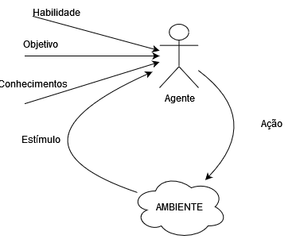

# Agentes

## Introdução

Um **agente** é algo que age em um ambiente, ele faz algo. Portanto animais, aviões, robôs e humanos podem ser considerados agentes.

Nós estamos interessados no que o agente faz, isto é, como é **age**. Nós julgamos um agente pelas suas ações.

Um agente é considerado inteligênte quando:
* O que ele faz é apropriado para as circunstâncias e objetivos, levando em conta ações de curto e longo prazo;
* É flexível à mudanças do ambiente e mudanças do objetivo;
* Aprende com a experiência;
* Faz escolhas apropriadas com dado um limite de memória e computacional.

Um **agente computacional** é um agente o qual as decisões podem ser explicadas em termos de computação. Isto é, as decisões podem ser quebradas em operações primitivas em dispositivos físicos.

Todos os agentes são limitados. Nenhum agente é onisciente ou onipotente. Agentes podem apenas observar tudo sobre o mundo em domínios especializados, onde "o mundo" é muito restrito. Agentes tem memória finita. Agentes no mundo real não têm tempo ilimitado para agir.

## Arquitetura de um Agente
IA é sobre raciocínio prático: raciocínio para fazer alguma coisa. Algumas percepções, raciocínio, e ações definem um **agente**. Um agente age em um **ambiente**. Um ambiente do agente pode muito bem incluir outros agentes. Vários agentes juntos em um mesmo ambiente é chamado **mundo**.

Um agente pode ser, por exemplo, alguns motores computacionais com sensores físicos e atuadores, chamdos **robôs**, onde o ambiente é uma comfiguração física.
Um agente pode ser um programa que age em um ambiente puramente computacional, um **programa agente**.

A qualquer momento, o que um agente faz depende de:
* **Conhecimento prévio** sobre o agente e sobre o ambiente;
* **Histórico** de interações com o ambiente;
* **Objetivo** que ele deve tentar alcançar ou **preferências** sobre o estado do mundo;
* **Habilidades**, as ações primitivas que um agente é capaz de operar.

Dentro da "caixa preta" do agente, ele possui um **estado de crença** interno que pode codificar crenças sobre o ambiente, o que ele aprendeu, o que está tentando fazer e o que pretende fazer. Um agente atualiza seu estado de crença com base nos estímulos que o ambiente manda para ele.