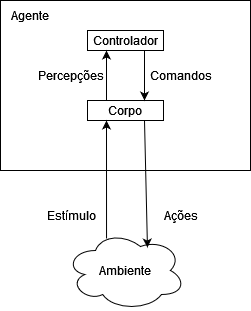

# Arquitetura de Agentes e Hierarquia de Controle

## Agentes
Um agente é algo que interage com o ambiente. Um agente pode, por exemplo, ser uma pessoa, um robô, um animal, etc.

Agentes recebem informações através de **sensores**. A ação de um agente depende da informação recebida pelos sensores. Esses sensores podem ou não, refletir no mundo real.

Agentes executam sua ação no mundo utilizando **atuadores**. O que o agente controla é a mensagem (comando) que envia para os atuadores.

## Sistemas de Agentes


A figura acima mostra uma interação genérica do agente com o ambiente. Juntos, o sistema consistênte do agente e do ambiente são chamados de sistema de agentes.

Um **sistema de agente** é constituido de um agente e do ambiente em que ele age. O agente recebe **estímulos** do ambiente e executa **ações** no ambiente.

Um **agente** é constituído de um **corpo** e de um **controlador**. O controlador recebe **percepções** do corpo e envia **comandos** para o corpo.

Um corpo inclui **sensores**  que convertem estímulos em percepções e **atuadores** que converte comandos em ações.

### A Função do Agente
Agente estão situados em um tempo, eles recebem dados sensoriais em um tempo t e fazem uma ação no tempo t.

Seja ***T*** o conjunto de pontos **temporais**. Assuma que ***T*** é totalmente ordenado e tenha alguma métrica que possa ser usada para medir a distância temporal entre dois pontos temporais.

Assuma que ***T*** tem um ponto inicial, que arbitrariamente chamamos de 0.

Suponha que ***P*** é um conjunto das possíveis percepções. Um **rastro de percepção**, ou **fluxo de percepção**, é a função ***T*** em ***P***. Que específica o que foi observado em cada tempo.

Suponha que ***C*** é o conjunto de comandos. Um **rastro de comandos** é a função ***T*** em ***C***. Que especifíca o comando para cada ponto temporal.

Um rastro de percepção para um agente é portanto a sequência de todas percepções do passado, presente e futuro recebidas pelo controlador.
O rastro de comando é a sequência de todos comandos do passado, presente e futuro passados pelo controlador. Os comandos podem ser uma função do histórico de percepções. Isso eleva o conceito de **transdução**, uma função que converte rastro de percepções em rastro de comandos.

Uma transdução é **causal** se, para todo tempo *t*, o comando no tempo *t* depende apenas de percepções até e incluindo o tempo *t*. A restrição de causalidade é necessária porque agentes estão situados no tempo, seus comandos a qualquer momento não podem depender de percepções futuras.

O **controlador** é a implementação de uma transdução causal.

O **histórico** de um agente no tempo *t* é o rastro de percepção do agente para todos os tempos anteriores ou no tempo *t* e o rastro de comando do agente antes do tempo *t*.

Portanto, uma **transdução causal** mapeia o histórico do agente no tempo *t* no comando no tempo *t*.

A **memória** ou **estado de crença** de um agente no tempo *t* é toda informação que o agente se lembra dos tempos anteriores. Um agente tem acesso apenasao histórico que ele codificou no estado de crença.
Portanto, o estado de crença encapsula toda a informação sobre o histórico que o agente pode usar para comandos atuais e futuros.

Uma **função de transição de estado de crença** para um tempo discreto é dado pela função:

```Lembrar: S x P -> S```

Onde 
* ***S*** é o conjunto de estados de crença;
* ***P*** é o conjunto de percepções possíveis.

Uma **função de comando** é a função

```Comando: S x P -> C```

Onde 
* ***S*** é o conjunto de estados de crença;
* ***P*** é o conjunto de percepções possíveis
* ***C*** é o conjunto de comandos possíveis.

## Controlador Hierárquico

Uma maneira que podemos imaginar a imagem retratada acima é separar o corpo em sensores e atuadores, com uma percepção complexa do sistema que alimenta a descrição do mundo em um mecanismo de raciocínio implementando um controlador que, por sua vez, emite comandos para os atuadores.
Isso acaba sendo uma arquitetura ruim para sistemas inteligentes. É muito lento e é difícil conciliar o raciocínio lento sobre objetivos complexos e de alto nível com a reação rápida que um agente precisa para tarefas de nível inferior, como evitar obstáculos.

Uma arquitetura alternativa para hierarquia de controladores como mostrado na imagem. Cada camada vê a camada acima como um **corpo virtual** para o qual envia comandos e recebe percepções. As camadas mais baixas rodam mais rapidamente, reagem a aspectos do mundo que precisam de reação rápida, e entregam uma vista simplista do mundo para a camada acima, escondendo detalhes que não são essenciais para as camadas superiores.
Pessoas têm que reagir ao mundo, em camadas mais baixas, em frações de segundos, mas planejam em camadas mais altas decadas a frente.

Uma implementação de uma camada especifica como as saídas de uma camada são uma função de suas entradas. A definição de função de estado de crença e função de comando se extendem para incluir entradas de comandos de alto nível, e cada camadas requere uma **função de percepção**, representada abaixo.

Portanto a camada implementa:

```
Lembrar: S x P x Ch -> S
Comandar: S x Pl x Ch -> Cl  
Falar: S x Pl x Ch -> Ph
```

Onde:
* ***S*** é o estado de crença; 
* ***Ch*** é o conjunto de comandos da camada superior;
* ***Pl*** é o conjunto de percepções da camada inferior;
* ***Cl*** é o conjunto de comandos da camada inferior
* ***Ph*** é o conjunto de percepções da camada superior


